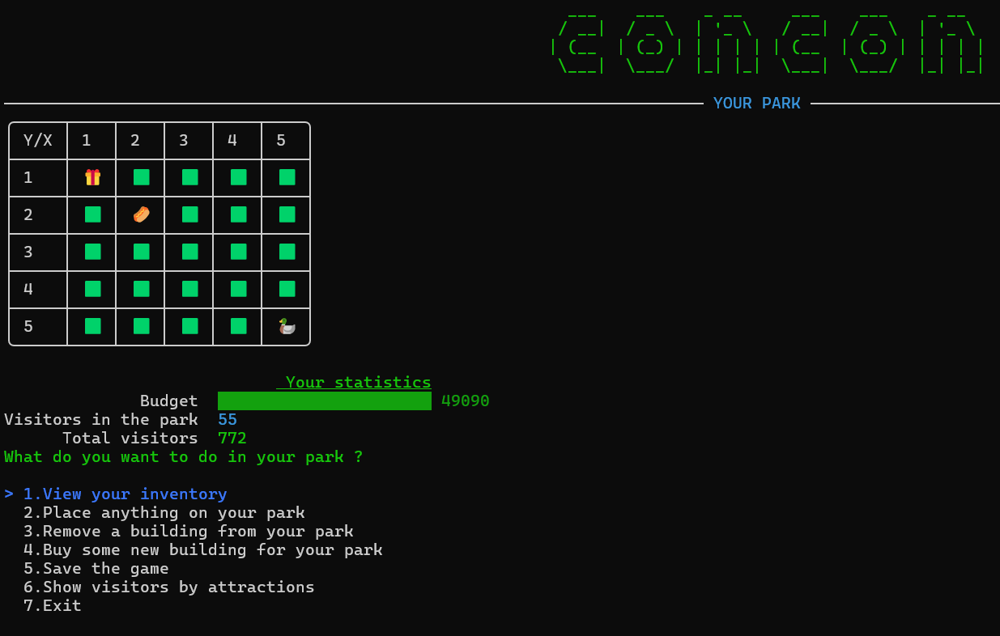

# 🎢 Amusement Park Project

Une application console interactive pour la gestion d'un parc d'attractions, développée en C# avec une interface utilisateur enrichie grâce à Spectre.Console.

## 🎡 Aperçu

Amusement Park Project est un simulateur de gestion de parc d'attractions en mode console. Construisez et gérez votre parc sur une grille 5x5, placez différentes attractions, surveillez vos finances et attirez des visiteurs pour développer votre empire du divertissement !

## ✨ Fonctionnalités

- 🗺️ **Vue du parc en grille** : Visualisation de votre parc en 2D avec placement d'attractions
- 🎢 **Gestion des attractions** :
  - Montagnes russes (RollerCoaster)
  - Maisons hantées (HauntedHouse)
  - Pêche aux canards (DuckFishing)
  - Restaurants et boutiques (FoodShop, GiftShop)
  - Aires de repos (Position)
- 👥 **Système de visiteurs** : Suivi en temps réel des visiteurs dans le parc
- 💰 **Gestion financière** : Budget et système monétaire avec gains
- 📦 **Inventaire** : Gestion complète de l'inventaire des attractions
- 🏗️ **Construction** : Placement et suppression d'attractions sur la grille
- 📊 **Statistiques en temps réel** : Visiteurs actuels, total des visiteurs, budget
- 🎨 **Interface console moderne** : Expérience utilisateur enrichie avec Spectre.Console
- 💾 **Sauvegarde** : Persistance des données avec SQLite

## 🛠 Technologies utilisées

- **Langage** : C# (.NET 9.0)
- **Interface utilisateur** : [Spectre.Console](https://spectreconsole.net/) pour l'expérience console moderne
- **Base de données** : SQLite avec Entity Framework Core
- **Sérialisation** : System.Text.Json avec convertisseurs personnalisés
- **Architecture** : Pattern Repository et Services
- **Tests** : Projet de tests unitaires inclus

## 📋 Prérequis

- [.NET 9.0 SDK](https://dotnet.microsoft.com/download/dotnet/6.0) ou version supérieure
- Système d'exploitation : Windows, macOS, ou Linux

## 🚀 Installation

1. **Clonez le repository**

   ```bash
   git clone https://github.com/PatoucheH/AmusementParkProject.git
   cd AmusementParkProject
   ```

2. **Restaurez les packages NuGet**

   ```bash
   dotnet restore
   ```

3. **Compilez le projet**

   ```bash
   dotnet build
   ```

4. **Exécutez l'application**
   ```bash
   dotnet run
   ```

## 🎮 Utilisation

Au lancement de l'application, vous serez accueilli par un menu principal stylisé avec l'art ASCII "tomcom" et une vue de votre parc sous forme de grille 5x5.

### Menu principal :

1. **View your inventory** - Consultez vos attractions disponibles
2. **Place anything on your park** - Placez des attractions sur la grille
3. **Remove a building from your park** - Supprimez des attractions
4. **Buy some new building for your park** - Achetez de nouvelles attractions
5. **Save the game** - Sauvegardez votre progression
6. **Show visitors by attractions** - Affichez les statistiques des visiteurs
7. **Exit** - Quittez le jeu

### Statistiques affichées :

- **Budget actuel** avec barre de progression verte
- **Visiteurs dans le parc** (temps réel)
- **Total des visiteurs** (historique)

### Système de grille :

- Grille 5x5 pour placer vos attractions
- Icônes colorées représentant différents types d'attractions
- Interface intuitive pour la gestion spatiale

## 📁 Structure du projet

```
AmusementParkProject/
├── Assets/                    # Ressources du jeu
├── Data/                      # Couche d'accès aux données
│   ├── BuildingJsonConverter.cs
│   ├── DataAccess.cs
│   ├── Grid.json.cs
│   ├── park.db               # Base de données SQLite
│   ├── ParkContext.cs
│   └── ParkRepository.cs
├── Migrations/               # Migrations Entity Framework
├── Models/                   # Modèles de données
│   ├── Attractions.cs        # Modèle des attractions
│   ├── DuckFishing.cs       # Attraction : Pêche aux canards
│   ├── FoodShop.cs          # Restaurant
│   ├── GiftShop.cs          # Boutique de souvenirs
│   ├── HauntedHouse.cs      # Maison hantée
│   ├── IBuilding.cs         # Interface pour les bâtiments
│   ├── Park.cs              # Modèle du parc
│   ├── Position.cs          # Gestion des positions
│   ├── RollerCoaster.cs     # Montagnes russes
│   └── Shops.cs             # Modèle des boutiques
├── Services/                # Logique métier
│   ├── EarnMoney.cs         # Service de gestion des revenus
│   ├── ParkService.cs       # Service principal du parc
│   └── Visitors.cs          # Gestion des visiteurs
├── Utils/                   # Utilitaires
│   ├── Menu.cs              # Gestion des menus
│   └── PlayMusic.cs         # Système audio
├── Test_AmusementPark/      # Tests unitaires
└── Program.cs               # Point d'entrée principal
```

## 🗄 Base de données

Le projet utilise une base de données SQLite (`park.db`) avec Entity Framework Core pour gérer :

### Types d'attractions supportées :

- 🎢 **RollerCoaster** : Montagnes russes
- 👻 **HauntedHouse** : Maisons hantées
- 🦆 **DuckFishing** : Jeu de pêche aux canards
- 🍔 **FoodShop** : Restaurants et points de restauration
- 🎁 **GiftShop** : Boutiques de souvenirs
- 🪑 **Position** : Aires de repos et zones d'attente

### Migrations

Le projet inclut un système de migrations Entity Framework pour gérer l'évolution du schéma de base de données.

## 📸 Captures d'écran

### Interface principale du jeu



_Interface console avec :_

- Art ASCII "tomcom" stylisé en vert
- Grille 5x5 du parc avec icônes colorées
- Statistiques en temps réel (Budget, Visiteurs)
- Menu interactif à 7 options

### Fonctionnalités visuelles

- 🎨 Interface console moderne avec Spectre.Console
- 🌈 Code couleur pour les différents types d'attractions
- 📊 Barres de progression pour le budget
- 🎯 Navigation intuitive par numéros

## 🔧 Développement

### Ajout de nouvelles fonctionnalités

1. Créez une nouvelle branche pour votre fonctionnalité
2. Implémentez vos modifications
3. Ajoutez des tests si nécessaire
4. Soumettez une pull request

### Architecture

Le projet suit une architecture en couches :

- **Présentation** : Interface utilisateur avec Spectre.Console
- **Logique métier** : Services pour la gestion des opérations
- **Accès aux données** : Repositories pour l'interaction avec SQLite

## 🤝 Contribuer

Les contributions sont les bienvenues ! Pour contribuer :

1. Forkez le projet
2. Créez votre branche de fonctionnalité (`git checkout -b feature/AmazingFeature`)
3. Committez vos changements (`git commit -m 'Add some AmazingFeature'`)
4. Pushez vers la branche (`git push origin feature/AmazingFeature`)
5. Ouvrez une Pull Request

## 👨‍💻 Auteur

**PatoucheH** - [GitHub](https://github.com/PatoucheH)

---

⭐ N'hésitez pas à donner une étoile au projet si vous l'appréciez !

## 📞 Support

Si vous rencontrez des problèmes ou avez des questions, n'hésitez pas à :

- Ouvrir une [issue](https://github.com/PatoucheH/AmusementParkProject/issues)
- Me contacter directement

---

_Développé avec ❤️ en C# et Spectre.Console_
